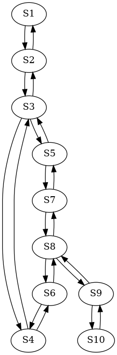

# Abstract

River. Two shores. It is necessary to transport the goat, wolf and cabbage clothes to the other side.

We need a model satisfied the following constaints: 
* the goat and the wolf can not be together without the peasant
* the goat and the cabbage can not be together without the peasant
* the boat can only hold one entity other than the peasant 
 
$w \iff \text{peasant}$ 

$x \iff \text{goat}$ 

$y \iff \text{wolf}$  

$z \iff \text{cabbage}$ 

so, $V = \{w, x, y, z\}$

Let all variables are binary: $1 \iff \text{"right shore"}$ and $0 \iff \text{"left shore"}$,
so $D = \{0, 1\}$ and $S_{0} = \{w \leftarrow 0, x \leftarrow 0, y \leftarrow 0, z \leftarrow 0\}$

Let also $V' = \{w', x', y', z'\}$

# FOL

All valid states is described with the following formula:

$R = (x = w) \lor (x \land \neg{y} \land \neg{z}) \lor (\neg{x} \land y \land x)$

| w | x | y | z |              R              |
|---|---|---|---|-----------------------------|
| 0 | 0 | 0 | 0 |              1              |
| 0 | 0 | 0 | 1 |              1              |
| 0 | 0 | 1 | 0 |              1              |
| 0 | 0 | 1 | 1 |              1              |
| 0 | 1 | 0 | 0 |              1              |
| 0 | 1 | 0 | 1 |              0              |
| 0 | 1 | 1 | 0 |              0              |
| 0 | 1 | 1 | 1 |              0              |
| 1 | 0 | 0 | 0 |              0              |
| 1 | 0 | 0 | 1 |              0              |
| 1 | 0 | 1 | 0 |              0              |
| 1 | 0 | 1 | 1 |              1              |
| 1 | 1 | 0 | 0 |              1              |
| 1 | 1 | 0 | 1 |              1              |
| 1 | 1 | 1 | 0 |              1              |
| 1 | 1 | 1 | 1 |              1              |

As we can see from the truth table, there are 8 valid states:

$S_{0}  = \{w \leftarrow 0, x \leftarrow 0, y \leftarrow 0, z \leftarrow 0\}$

$S_{1}  = \{w \leftarrow 1, x \leftarrow 1, y \leftarrow 0, z \leftarrow 0\}$

$S_{2}  = \{w \leftarrow 0, x \leftarrow 1, y \leftarrow 0, z \leftarrow 0\}$

$S_{3}  = \{w \leftarrow 1, x \leftarrow 1, y \leftarrow 1, z \leftarrow 0\}$

$S_{4}  = \{w \leftarrow 1, x \leftarrow 1, y \leftarrow 0, z \leftarrow 1\}$

$S_{5}  = \{w \leftarrow 0, x \leftarrow 0, y \leftarrow 1, z \leftarrow 0\}$

$S_{6}  = \{w \leftarrow 0, x \leftarrow 0, y \leftarrow 0, z \leftarrow 1\}$

$S_{7}  = \{w \leftarrow 1, x \leftarrow 0, y \leftarrow 1, z \leftarrow 1\}$

$S_{8}  = \{w \leftarrow 0, x \leftarrow 0, y \leftarrow 1, z \leftarrow 1\}$

$S_{9}  = \{w \leftarrow 1, x \leftarrow 1, y \leftarrow 1, z \leftarrow 1\}$

And the Kripke model is 

$\{w_{0} \leftarrow 0, x_{0} \leftarrow 0, y_{0} \leftarrow 0, z_{0} \leftarrow 0\} \land$ 

$\{w_{1} \leftarrow \neg{w_{0}}, x_{1} \leftarrow \neg{x_{1}}, y_{1} \leftarrow y_{0}, z_{1} \leftarrow z_{0}\} \land$ 

$\{w_{2} \leftarrow \neg{w_{1}}, x_{2} \leftarrow x_{1}, y_{2} \leftarrow y_{1}, z_{2} \leftarrow z_{1}\} \land$ 

$\{w_{3} \leftarrow \neg{w_{2}}, x_{3} \leftarrow x_{2}, y_{3} \leftarrow (y_{2} \lor \neg{y_{2}}), z_{3} \leftarrow (z_{2} \lor \neg{z_{2}})\} \land$ 

$\{w_{4} \leftarrow \neg{w_{3}}, x_{4} \leftarrow \neg{x_{3}}, y_{4} \leftarrow y_{3}, z_{4} \leftarrow z_{3}\} \land$ 

$\{w_{5} \leftarrow \neg{w_{4}}, x_{5} \leftarrow x_{4}, y_{5} \leftarrow (y_{4} \lor \neg{y_{4}}), z_{5} \leftarrow (z_{4} \lor \neg{z_{4}})\} \land$ 

$\{w_{6} \leftarrow \neg{w_{5}}, x_{6} \leftarrow x_{5}, y_{6} \leftarrow y_{5}, z_{6} \leftarrow z_{5}\} \land$ 

$\{w_{7} \leftarrow \neg{w_{6}}, x_{7} \leftarrow \neg{x_{6}}, y_{7} \leftarrow y_{6}, z_{7} \leftarrow z_{6}\}$

