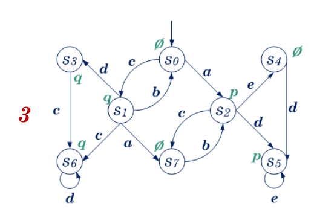

(модель 3, задание 2)

### Невидимые действия 

* по $p : \emptyset$ 
* по $q : \{d,e\}$ 

### Видимые действия 

* по $p : \{a,b,c,d,e\}$ 
* по $q : \{a,b,c,d\}$ 

-

* a - изм. $p, q : s_{0} \rightarrow s_{2}, s_{1} \rightarrow s_{7}$ 
* b - изм. $p, q : s_{7} \rightarrow s_{2}, s_{1} \rightarrow s_{0}$ 
* c - изм. $p, q : s_{2} \rightarrow s_{7}, s_{0} \rightarrow s_{1}$ 
* d - изм. $p, q : s_{4} \rightarrow s_{5}, s_{6} \rightarrow s_{6}$ 
* e - изм. $p : s_{5} \rightarrow s_{5}$ 